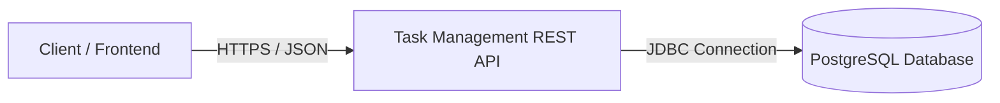
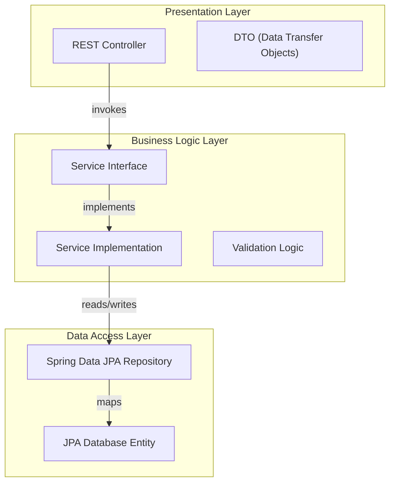
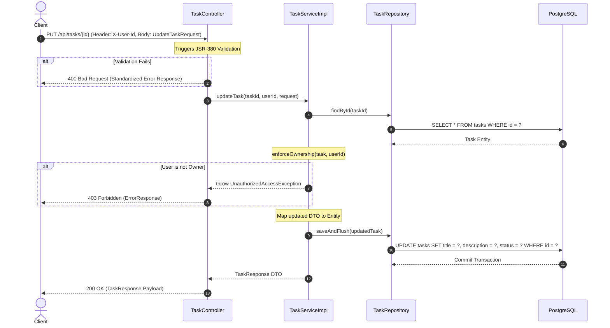
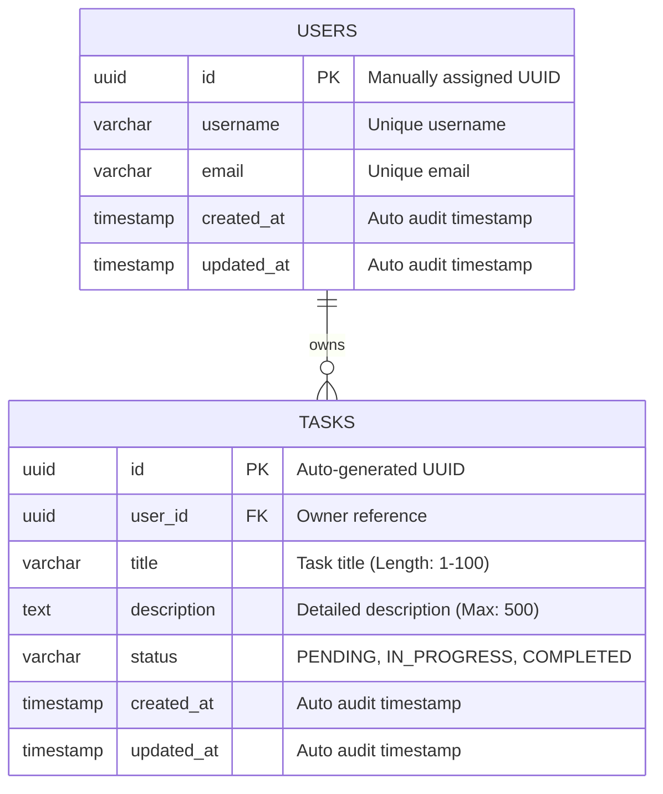
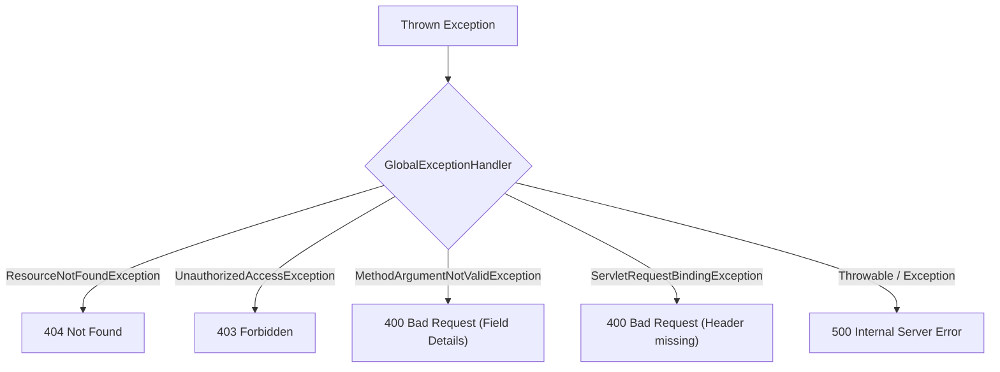

# System Architecture Documentation

This document describes the architectural design, architectural layers, data models, exception handling strategy, and testing paradigm of the **Task Management API** backend application.

---

## 1. High-Level Architecture

The system is constructed as a secure, stateless **RESTful API** leveraging **Spring Boot 3**. It communicates over HTTP/JSON and integrates with a **PostgreSQL** database for persistence.



Key characteristics:
- **Stateless Design**: The server stores no HTTP session state. All requests are self-contained.
- **Tenant Isolation**: Strict user-level security context is parsed from HTTP headers (`X-User-Id`), isolating task domains completely without complex authorization tables.

---

## 2. Layered Architecture

The application implements a standard, unidirectional **layered architecture** pattern. Control flows sequentially downwards; circular dependencies are forbidden.



- **Presentation Layer**: Exposes REST endpoints, parses path/header variables, triggers JSR-380 input validations, and maps exceptions using `@RestControllerAdvice`.
- **Business Logic Layer**: Enforces business invariants, verifies ownership controls, maps case-insensitive enums, and handles transaction scopes.
- **Data Access Layer**: Abstracts JDBC boilerplate using Hibernate Object-Relational Mapping (ORM) and handles physical queries.

---

## 3. Package Structure

The system enforces the **Package-by-Feature** paradigm. Classes are grouped by business capability rather than technical role (with the exception of global configs and shared abstractions).

```text
com.example.taskmanagement/
│
├── common/                         # Shared Cross-Cutting Concerns
│   └── exception/                  # Standardized Exception Definitions & Global Handlers
│
├── config/                         # Global Application Configurations
│   ├── swagger/                    # Swagger/OpenAPI Definitions
│   └── seeder/                     # Database Seeders for Dev Coordination
│
├── task/                           # Task Feature Capsule (Encapsulated Capsule)
│   ├── controller/                 # Task REST Endpoint Controller
│   ├── dto/                        # Task Create/Update Request & Response DTOs
│   ├── entity/                     # Task JPA Entity Class
│   ├── repository/                 # Task Spring Data JPA Interface
│   └── service/                    # Task Service Interface & Implementations
│
└── user/                           # User Feature Capsule
    ├── entity/                     # User JPA Entity Class
    └── repository/                 # User Spring Data JPA Interface
```

---

## 4. Request Flow

The diagram below details the sequence of events and components involved when a user modifies a task:



---

## 5. Entity Relationships

The relational mapping is kept simple and optimized. A `User` acts as an independent parent domain, holding a **One-to-Many** relationship with `Task` entities.



---

## 6. Database Design

### USERS Table
Represents persisted system users. Primary keys are manually populated to remain synchronized with frontend mock authentication profiles.
- **`id`**: `UUID` (PRIMARY KEY)
- **`username`**: `VARCHAR(255)` (UNIQUE, NOT NULL)
- **`email`**: `VARCHAR(255)` (UNIQUE, NOT NULL)
- **`created_at`**: `TIMESTAMP` (NOT NULL)
- **`updated_at`**: `TIMESTAMP` (NOT NULL)

### TASKS Table
Represents task tickets.
- **`id`**: `UUID` (PRIMARY KEY, Default: `gen_random_uuid()`)
- **`user_id`**: `UUID` (FOREIGN KEY REFERENCES `users(id)`, NOT NULL, CASCADE DELETE)
- **`title`**: `VARCHAR(100)` (NOT NULL)
- **`description`**: `TEXT` (NULLABLE, Constraint: Max 500 characters)
- **`status`**: `VARCHAR(20)` (NOT NULL, Enforces: `PENDING`, `IN_PROGRESS`, `COMPLETED`)
- **`created_at`**: `TIMESTAMP` (NOT NULL)
- **`updated_at`**: `TIMESTAMP` (NOT NULL)

### 📊 Indexing Optimization Strategy
To optimize high-concurrency read queries:
1. **Foreign Key Indexing**: A database index is automatically maintained on the `tasks.user_id` column. This guarantees that `GET /api/tasks` (invoking `SELECT * FROM tasks WHERE user_id = ?`) executes with **$O(\log N)$** logarithmic search complexity instead of performing expensive full table scans.

---

## 7. Exception Handling Strategy

Standardized, centralized error processing prevents technical stack leakage (e.g. stack traces, raw SQL queries) to external clients and provides high-quality debugging diagnostics.



Standardized Error Body:
```json
{
  "timestamp": "LocalDateTime",
  "status": "int (HTTP status value)",
  "error": "string (Reason phrase)",
  "message": "string (Developer description)",
  "path": "string (Requested URI)",
  "details": "Map<String, String> (Optional validation details)"
}
```

---

## 8. Testing Strategy

The system is validated across a rigorous, multi-tier testing pyramid to guarantee regression-free feature expansions.

```text
   ▲
  / \      E2E Integration (TaskApiIntegrationTest)
 /   \     - Starts full Spring context on RANDOM_PORT.
/ E2E \    - Employs TestRestTemplate to issue actual network HTTP calls.
-------
/     \    Slice Testing (TaskControllerTest, TaskRepositoryTest)
/Slice \   - Mocks dependencies at borders.
---------  - Tests database query mappings and serialization limits.
/       \  Unit Testing (TaskServiceImplTest)
/ Unit  \  - Focuses purely on class behaviors.
---------  - Uses Mockito to verify mocks and isolate logic.
```

- **Testcontainers & Database Isolation**: Slice and E2E integration test runs spin up dynamic PostgreSQL containers via Testcontainers.
- **UTC Timezone Safety**: The test run default timezone is dynamically locked to `UTC`, preventing regional local timezone parsing discrepancies and database connection failures.
- **Docker-less host fallback**: Includes an automated fallback sequence connecting seamlessly to active local host-based docker containers in case of host OS socket limitations.
