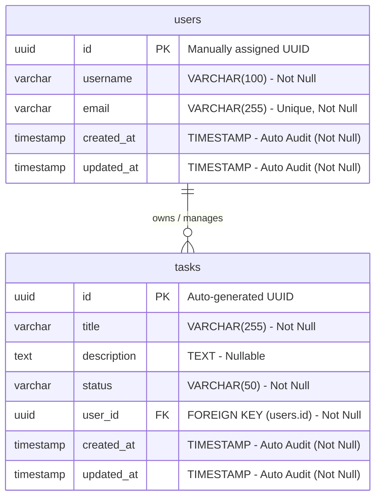

# Database Entity Relationship Diagram (ERD) Documentation

This document describes the logical and physical database model designed for the **Task Management System**, detailing the entities, field parameters, constraints, indexing strategies, and relationships.

---

## 1. Mermaid Entity Relationship Diagram (ERD)

The relational schema is optimized to establish clean ownership isolation. A parent `User` entity holds a **One-to-Many** relationship with the `Task` entity.

---

## 2. Entity Descriptions & Table Specifications

The physical database model consists of two primary tables: `users` and `tasks`.

### 2.1. `users` Table
Stores registered task owners. Primary keys are manually mapped (not auto-generated) to allow seamless synchronization with external auth systems and local seed datasets.

| Column Name | Physical Data Type | Constraints / Attributes | Description |
| :--- | :--- | :--- | :--- |
| **`id`** | `UUID` | **`PRIMARY KEY`**, `NOT NULL`, `UPDATABLE = FALSE` | Unique user identifier manually assigned. |
| **`username`** | `VARCHAR(100)` | `NOT NULL` | The user's screen name or display handle. |
| **`email`** | `VARCHAR(255)` | **`UNIQUE`**, `NOT NULL` | Unique electronic mail address. |
| **`created_at`** | `TIMESTAMP` | `NOT NULL`, `UPDATABLE = FALSE` | Automatically populated audit timestamp upon user creation. |
| **`updated_at`** | `TIMESTAMP` | `NOT NULL` | Automatically updated audit timestamp upon modifications. |

---

### 2.2. `tasks` Table
Stores task items. The lifecycle and visibility of each task are bound to a parent user record.

| Column Name | Physical Data Type | Constraints / Attributes | Description |
| :--- | :--- | :--- | :--- |
| **`id`** | `UUID` | **`PRIMARY KEY`**, `NOT NULL`, `UPDATABLE = FALSE` | Auto-generated task identifier using standard `GenerationType.UUID` (PostgreSQL `gen_random_uuid()`). |
| **`title`** | `VARCHAR(255)` | `NOT NULL`, `Constraint: 1-255 chars` | Title summarizing the task. |
| **`description`** | `TEXT` | `NULLABLE` | Optional detailed description. Stored as `TEXT` for unbounded text length limits. |
| **`status`** | `VARCHAR(50)` | `NOT NULL` | Current state of the task. Mapped via `@Enumerated(EnumType.STRING)` from the `TaskStatus` Enum. |
| **`user_id`** | `UUID` | **`FOREIGN KEY`**, `NOT NULL` | Relational reference to the owner user (`users.id`). |
| **`created_at`** | `TIMESTAMP` | `NOT NULL`, `UPDATABLE = FALSE` | Automatically populated audit timestamp. |
| **`updated_at`** | `TIMESTAMP` | `NOT NULL` | Automatically updated audit timestamp. |

---

## 3. Relationships & Referential Integrity

### 3.1. User to Task Relation (`users 1 ── 0..* tasks`)
- **Relationship Type**: One-to-Many (A user can own zero, one, or many tasks. A task must belong to exactly one user).
- **Physical implementation**: Map via a Foreign Key column `user_id` inside the `tasks` table referencing `users(id)`.
- **Eager vs. Lazy Loading**: Configured with `@ManyToOne(fetch = FetchType.LAZY)` inside the `Task` class. When querying task details, Hibernate will *not* perform an expensive SQL join to retrieve user metadata unless `task.getUser()` is explicitly requested by the business code.
- **Referential Integrity**: Standard constraint rules are configured (`ON DELETE CASCADE` or orphan cleanup depending on hibernate settings) preventing orphaned tasks from lingering if a parent user is removed.

---

## 4. Key Constraints

- **Primary Key Constraints**:
  - `users.pk_users`: Guarantees row identity uniqueness for every user record.
  - `tasks.pk_tasks`: Guarantees row identity uniqueness for every task record.
- **Unique Constraint (`users.email`)**:
  - Enforces that no two user profiles share the same email address at the database level, preventing registration collisions.
- **Not-Null Constraints**:
  - Enforced on essential columns (`username`, `email`, `title`, `status`, `user_id`) to protect schema schema integrity from incomplete or null payload transmissions.

---

## 5. Indexing Strategy & Performance Optimizations

To optimize read performance in production environments, the schema maintains two custom indexes on high-traffic query columns:

### 1. **`idx_tasks_user_id`**
- **Target Column**: `tasks.user_id`
- **Rationale**: The most frequent query in the task management application is retrieving a user's task list (triggered by calling `GET /api/tasks` which invokes `SELECT * FROM tasks WHERE user_id = ?`). 
- **Performance Impact**: Creates a B-Tree search structure, accelerating the lookup complexity from an $O(N)$ full table scan to an **$O(\log N)$** binary search, preventing performance degradation as the `tasks` table grows.

### 2. **`idx_tasks_status`**
- **Target Column**: `tasks.status`
- **Rationale**: Speeds up queries that filter tasks by status (e.g. searching for all `IN_PROGRESS` or `COMPLETED` tasks).
- **Performance Impact**: Drastically reduces query execution times when users sort, filter, or index dashboard items by their status.
