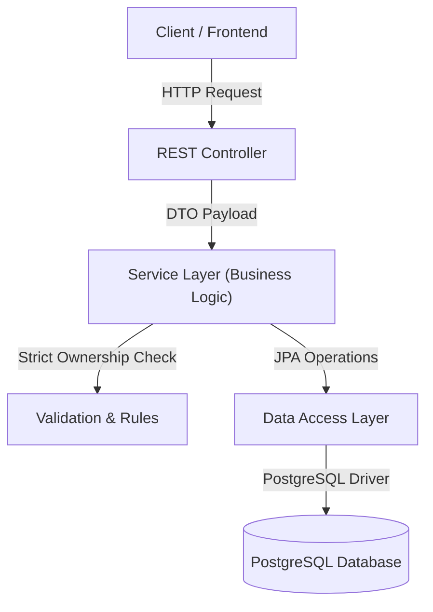

# Task Management API Backend

A professional, enterprise-grade, high-performance **Task Management REST API** built using **Spring Boot 3**, **Java 21**, and **PostgreSQL**. The project is architected following the **Package-by-Feature** paradigm to ensure clean separation of concerns, high maintainability, and horizontal scalability.

---

## 🗺️ Table of Contents
1. [Project Overview](#-project-overview)
2. [Key Features](#-key-features)
3. [Architecture Overview](#-architecture-overview)
4. [Tech Stack](#-tech-stack)
5. [Prerequisites](#-prerequisites)
6. [Installation & Setup](#-installation--setup)
7. [Configuration](#-configuration)
8. [Running the Application](#-running-the-application)
9. [Running the Test Suite](#-running-the-test-suite)
10. [API Endpoints Specification](#-api-endpoints-specification)
11. [Docker & Containerization](#-docker--containerization)
12. [Project Directory Structure](#-project-directory-structure)

---

## 🌟 Project Overview

The Task Management API serves as the robust backend engine for handling user tasks. It enforces strict user data isolation, implements JSR-380 validation, supports flexible status transitions, and implements standardized error mapping.

---

## ⚡ Key Features

- **Robust CRUD Lifecycle**: Full creation, retrieval, modification, and deletion workflows for user tasks.
- **Strict Data Ownership**: Secure data isolation by matching tasks against user ids supplied via headers (`X-User-Id`), preventing unauthorized reading or cross-mutations.
- **JSR-380 Request Validation**: Automated payload vetting (e.g., blank-checks, character length boundaries).
- **Flexible Status Transitions**: Enforces clean state workflows (`PENDING`, `IN_PROGRESS`, `COMPLETED`) supporting case-insensitive input.
- **Global Error Standardizer**: Intercepts structural exceptions (validation failures, authorization rejections, resource-not-found) to return unified client-friendly JSON structures.
- **Automatic Audit Trail**: Automated timestamp generation (`createdAt`, `updatedAt`) using JPA lifecycle audits.
- **Database Seeders**: Smart seeder to initialize pre-defined mock users securely for local frontend coordination.

---

## 🏗️ Architecture Overview

The system adheres to a highly modular **Package-by-Feature** architecture. Each capability (e.g., `task`, `user`) encapsulates its own Controller, Service, Repository, Entity, and DTO classes.



---

## 💻 Tech Stack

- **Core Framework**: Spring Boot 3.2.5
- **Language**: Java 21 (LTS)
- **Data Access**: Spring Data JPA & Hibernate
- **Database**: PostgreSQL (Production/Dev), H2 (Option)
- **Database Migration**: Hibernate Automatic DDL
- **Testing Engine**: JUnit 5, Mockito
- **Integration Testing**: Testcontainers (PostgreSQL container)
- **Containerization**: Docker, Docker Compose

---

## 📋 Prerequisites

Before setting up locally, ensure you have the following installed:
- **Java Development Kit (JDK) 21**
- **Apache Maven 3.9+**
- **Docker Desktop** (Required for database and running Testcontainers integration tests)
- An API Client (e.g., **Postman**, **cURL**, or IntelliJ HTTP Client)

---

## 🚀 Installation & Setup

1. **Clone the Repository**:
   ```bash
   git clone <repository-url>
   cd ai-task-manager-fsdlc/backend
   ```

2. **Spin Up PostgreSQL Container**:
   Ensure Docker is active, then run a PostgreSQL database container locally:
   ```bash
   docker run --name postgres-tasks2db \
     -e POSTGRES_DB=tasks2db \
     -e POSTGRES_USER=postgres \
     -e POSTGRES_PASSWORD=postgres \
     -p 5432:5432 \
     -d postgres:latest
   ```

3. **Build the Application**:
   Compile the source files and package them into a runnable JAR (skipping tests initially):
   ```bash
   mvn clean package -DskipTests
   ```

---

## ⚙️ Configuration

Application settings are declared inside [application.yml](file:///d:/FPTU/8.Summer26/AI%20Coding%20Agent/Antigravity/AI-Era/S2/ai-task-manager-fsdlc/backend/src/main/resources/application.yml).

```yaml
spring:
  datasource:
    url: jdbc:postgresql://localhost:5432/tasks2db?options=-c%20timezone=UTC
    username: postgres
    password: postgres
    driver-class-name: org.postgresql.Driver
  jpa:
    database-platform: org.hibernate.dialect.PostgreSQLDialect
    hibernate:
      ddl-auto: update
    show-sql: true
    properties:
      hibernate:
        format_sql: true
```

---

## 🏃 Running the Application

To boot the backend service locally:

```bash
mvn spring-boot:run
```

The application will start on port `8080`. You will see startup logs in the console. 
> [!NOTE]
> The database seeder will automatically check and insert a default system user (`UUID: 550e8400-e29b-41d4-a716-446655440000`) for development.

---

## 🧪 Running the Test Suite

The project features a full testing pyramid consisting of **45 robust tests** (Unit, Slice, and E2E Integration) boasting **>98% branch coverage**:

```bash
mvn test
```

### Advanced Test Configuration
The repository integration tests (`TaskRepositoryTest`) and API E2E tests (`TaskApiIntegrationTest`) use **Testcontainers** to dynamically boot PostgreSQL containers. 
- **Hybrid Fallback**: If Docker named pipe permissions or socket configurations prevent Testcontainers from initializing, the test suite automatically falls back to utilizing the active host-based PostgreSQL container at `localhost:5432` with pre-forced `UTC` session timezones to ensure seamless builds on Windows, macOS, and Linux.

To run a specific test class:
```bash
mvn test -Dtest=TaskApiIntegrationTest
```

---

## 📡 API Endpoints Specification

All endpoints require a valid user identifier passed inside the `X-User-Id` HTTP Header.

### 1. Create a Task
* **Method & Path**: `POST /api/tasks`
* **Headers**: 
  - `X-User-Id: 550e8400-e29b-41d4-a716-446655440000`
  - `Content-Type: application/json`
* **Request Body**:
  ```json
  {
    "title": "Complete Code Documentation",
    "description": "Write a premium, beautiful README file for FPTU project."
  }
  ```
* **Response (`201 Created`)**:
  ```json
  {
    "id": "a1b2c3d4-e5f6-7a8b-9c0d-1e2f3a4b5c6d",
    "title": "Complete Code Documentation",
    "description": "Write a premium, beautiful README file for FPTU project.",
    "status": "PENDING",
    "createdAt": "2026-05-31T09:00:00Z",
    "updatedAt": "2026-05-31T09:00:00Z"
  }
  ```

### 2. Update a Task
* **Method & Path**: `PUT /api/tasks/{taskId}`
* **Headers**: `X-User-Id: <user-id>`
* **Request Body**:
  ```json
  {
    "title": "Complete Code Documentation",
    "description": "Updated description details",
    "status": "IN_PROGRESS"
  }
  ```
* **Response (`200 OK`)**:
  ```json
  {
    "id": "a1b2c3d4-e5f6-7a8b-9c0d-1e2f3a4b5c6d",
    "title": "Complete Code Documentation",
    "description": "Updated description details",
    "status": "IN_PROGRESS",
    "createdAt": "2026-05-31T09:00:00Z",
    "updatedAt": "2026-05-31T09:15:00Z"
  }
  ```

### 3. Get Task Detail
* **Method & Path**: `GET /api/tasks/{taskId}`
* **Headers**: `X-User-Id: <user-id>`
* **Response (`200 OK`)**

### 4. Get Task List
* **Method & Path**: `GET /api/tasks`
* **Headers**: `X-User-Id: <user-id>`
* **Response (`200 OK`)**:
  ```json
  {
    "tasks": [
      {
        "id": "a1b2c3d4-e5f6-7a8b-9c0d-1e2f3a4b5c6d",
        "title": "Complete Code Documentation",
        "status": "IN_PROGRESS"
      }
    ]
  }
  ```

### 5. Delete a Task
* **Method & Path**: `DELETE /api/tasks/{taskId}`
* **Headers**: `X-User-Id: <user-id>`
* **Response**: `204 No Content`

---

## 🐳 Docker & Containerization

To run the entire backend containerized:

1. **Dockerfile Configuration**:
   The `Dockerfile` employs a multi-stage build using `maven:3.9.6-eclipse-temurin-21` for packaging, and a light-weight `eclipse-temurin:21-jre-alpine` runtime image.

2. **Build the Docker Image**:
   ```bash
   docker build -t task-management-api:latest .
   ```

3. **Run the Containerized Backend**:
   Ensure it can communicate with your database (bind to the same network or host IP):
   ```bash
   docker run -p 8080:8080 \
     -e SPRING_DATASOURCE_URL=jdbc:postgresql://host.docker.internal:5432/tasks2db \
     task-management-api:latest
   ```

---

## 📂 Project Directory Structure

```text
backend/
├── src/
│   ├── main/
│   │   ├── java/com/example/taskmanagement/
│   │   │   ├── common/                # Shared utilities & Global Exception Handlers
│   │   │   ├── config/                # General Spring Configurations & Seeders
│   │   │   ├── task/                  # Task Feature Capsule (Package-by-Feature)
│   │   │   │   ├── controller/        # REST Controllers
│   │   │   │   ├── dto/               # Request & Response Payload Models
│   │   │   │   ├── entity/            # JPA Data Entities
│   │   │   │   ├── repository/        # Spring Data JPA Repositories
│   │   │   │   └── service/           # Core Business Logics
│   │   │   ├── user/                  # User Feature Capsule
│   │   │   └── TaskManagementApplication.java # Spring Boot Bootstrap
│   │   └── resources/
│   │       ├── application.yml        # Active YAML Configurations
│   │       └── db/                    # SQL Seed Scripts & Migrations
│   └── test/
│       └── java/com/example/taskmanagement/
│           └── task/
│               ├── controller/        # Controller MockMvc Slice Tests
│               ├── integration/       # End-to-End REST HTTP Port Tests
│               ├── repository/        # Repository JPA Database Slice Tests
│               └── service/           # Service Unit Tests (Mockito)
├── pom.xml                            # Project Object Model Maven Settings
└── Dockerfile                         # Multi-stage Containerization Recipe
```
